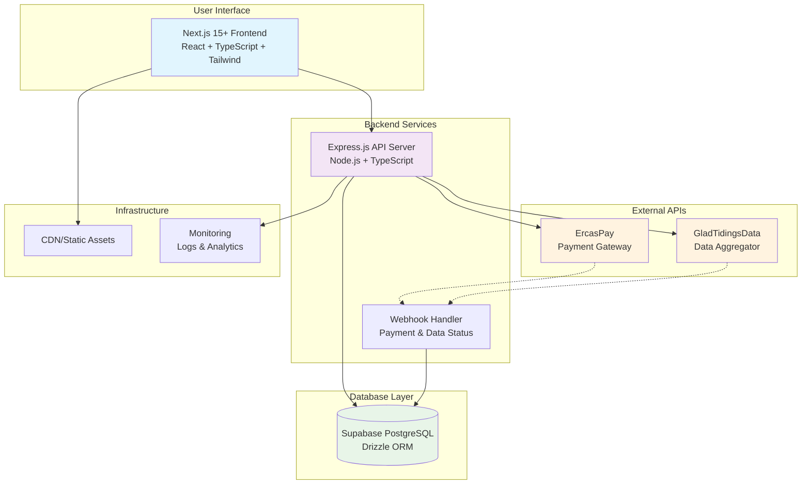
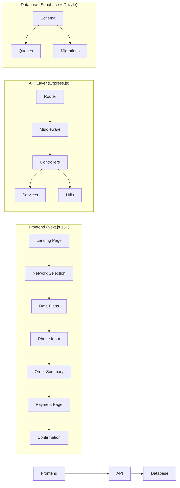
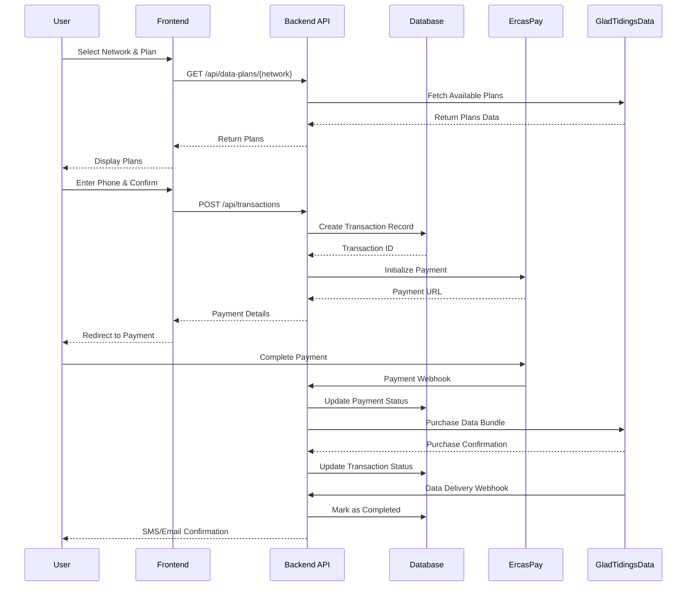
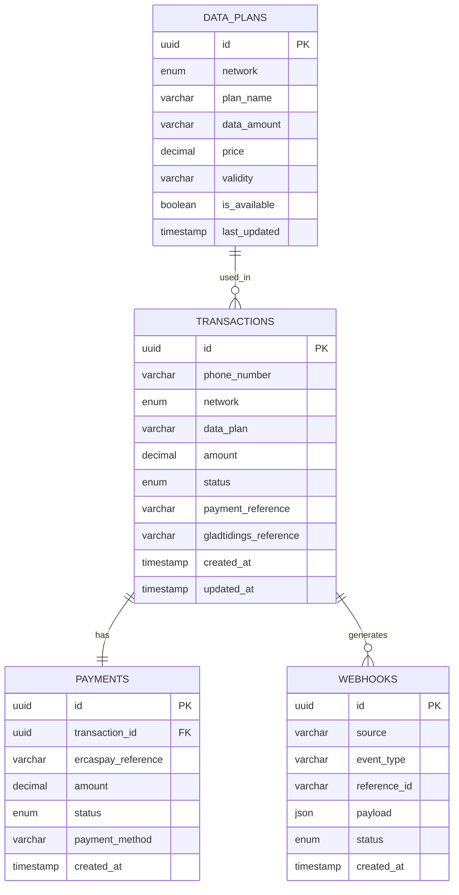
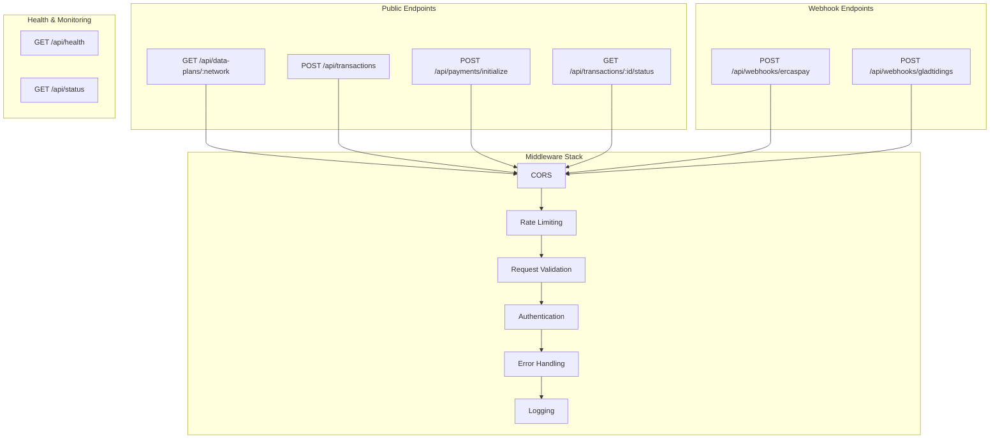
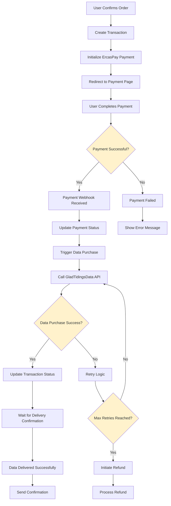
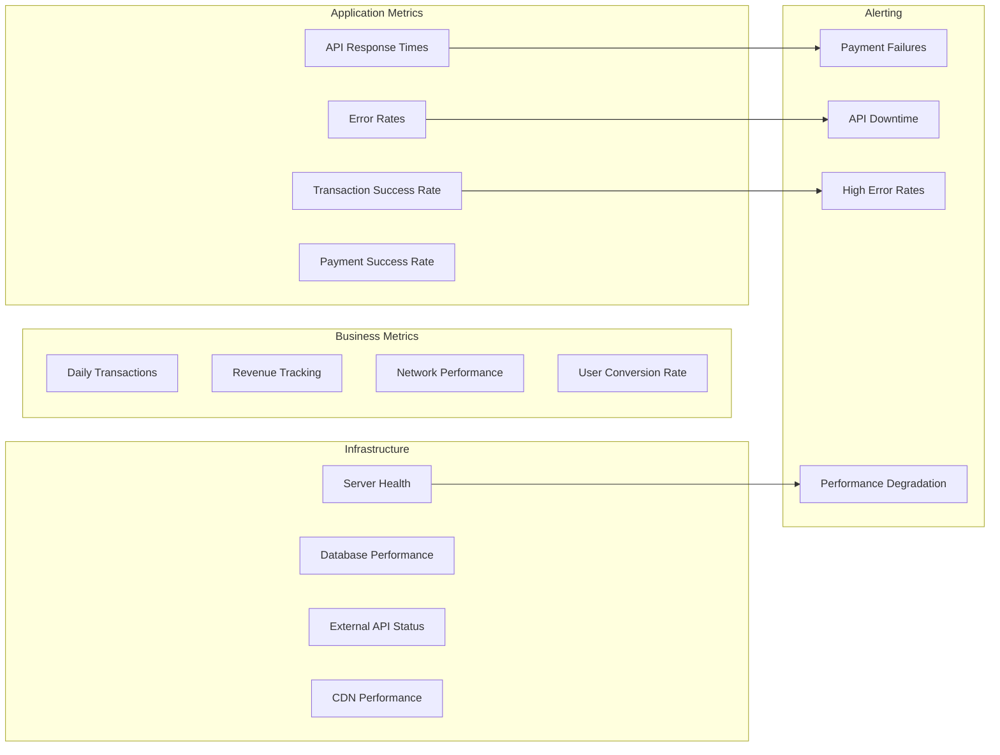
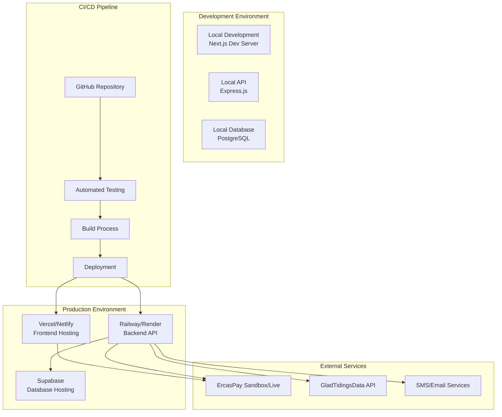
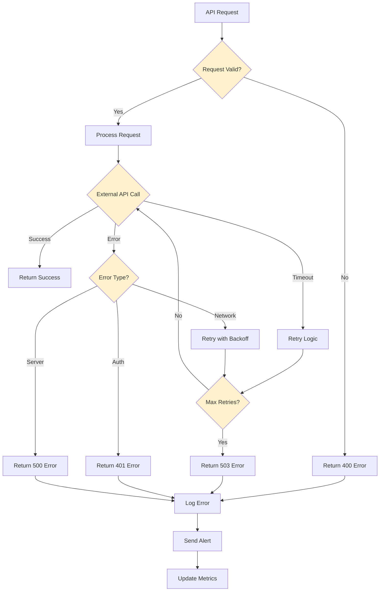

# Data Purchase MVP - System Architecture & Design

## 1. High-Level System Architecture

## 2. Detailed Component Architecture

## 3. Data Flow Diagram

## 4. Database Schema Design

## 5. API Endpoint Architecture

## 6. Payment Flow Architecture

## 7. Security Architecture

```mermaid
graph TB
    subgraph "Security Layers"
        A[HTTPS/TLS 1.3<br/>SSL Certificate]
        B[API Rate Limiting<br/>DDoS Protection]
        C[Input Validation<br/>SQL Injection Prevention]
        D[Webhook Signature<br/>Verification]
        E[Environment Variables<br/>Secret Management]
        F[CORS Policy<br/>Origin Validation]
    end
    
    subgraph "Data Protection"
        G[PCI DSS Compliance<br/>via ErcasPay]
        H[No Card Data Storage<br/>Tokenization]
        I[Audit Logging<br/>Transaction Trail]
        J[Data Encryption<br/>at Rest & Transit]
    end
    
    subgraph "Access Control"
        K[API Key Authentication<br/>External Services]
        L[Request Signing<br/>Webhook Verification]
        M[IP Whitelisting<br/>Admin Access]
    end
    
    A --> B --> C --> D --> E --> F
    G --> H --> I --> J
    K --> L --> M
```

## 8. Monitoring & Observability

## 9. Deployment Architecture

## 10. Error Handling & Recovery

---

**Architecture Version**: 1.0  
**Last Updated**: September 6, 2025  
**Tech Stack**: Next.js 15+, Express.js, Supabase, Drizzle ORM, ErcasPay, GladTidingsData